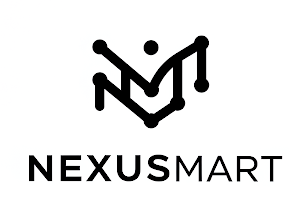

<div align="center">
  
  
  # 🛍️ NexuSmart - Modern Ecommerce Platform
  
  <p align="center">
    <strong>A cutting-edge, responsive ecommerce frontend built with Next.js and modern web technologies</strong>
  </p>
  
  <p align="center">
    <a href="#demo">View Demo</a> •
    <a href="#features">Features</a> •
    <a href="#installation">Installation</a> •
    <a href="#usage">Usage</a> •
    <a href="#contributing">Contributing</a>
  </p>
  
  <p align="center">
    
    
    
    
  </p>
</div>

---

## 🌟 Overview

NexuSmart is a modern, responsive ecommerce frontend application that provides an exceptional shopping experience. Built with performance, accessibility, and user experience in mind, it offers a comprehensive solution for online retail businesses.

## ✨ Features

### 🎨 **Modern UI/UX**
- Clean, intuitive interface with smooth animations
- Fully responsive design for all devices
- Dark/Light mode support
- Accessibility-first approach

### 🛒 **Shopping Experience**
- Advanced product search and filtering
- Interactive product galleries
- Real-time cart updates
- Wishlist functionality
- Recently viewed products tracking

### 🔐 **User Management**
- Secure user authentication
- Profile management
- Order history tracking
- Address book management

### 💳 **Checkout & Payments**
- Streamlined checkout process
- Multiple payment gateway integration
- Guest checkout option
- Order confirmation and tracking

### 📱 **Mobile Optimized**
- Progressive Web App (PWA) ready
- Touch-friendly interface
- Offline functionality
- Fast loading times

## 🚀 Demo

<div align="center">
  
  
  <p><em>Homepage featuring hero banner, featured products, and category grid</em></p>
</div>

### 📱 Live Demo
> **[Visit Live Demo](https://nexusmart-demo.vercel.app)** *(Replace with your actual demo URL)*

## 🛠️ Tech Stack

| Technology | Purpose | Version |
|------------|---------|---------|
| **Next.js** | React Framework | 14.0+ |
| **React** | UI Library | 18.0+ |
| **Tailwind CSS** | Styling | 3.0+ |
| **JavaScript** | Programming Language | ES6+ |
| **Vercel** | Deployment | Latest |

## 📦 Installation

### Prerequisites
- Node.js (v18.0 or higher)
- npm or yarn package manager
- Git

### Quick Start

1. **Clone the repository**
   ```bash
   git clone https://github.com/yourusername/nexusmart-frontend.git
   ```

2. **Navigate to project directory**
   ```bash
   cd nexusmart-frontend
   ```

3. **Install dependencies**
   ```bash
   npm install
   # or
   yarn install
   ```

4. **Set up environment variables**
   ```bash
   cp .env.example .env.local
   ```
   
   Update the `.env.local` file with your configuration:
   ```env
   NEXT_PUBLIC_API_URL=your_api_url
   NEXT_PUBLIC_STRIPE_KEY=your_stripe_key
   NEXT_PUBLIC_APP_URL=http://localhost:3000
   ```

5. **Start the development server**
   ```bash
   npm run dev
   # or
   yarn dev
   ```

6. **Open your browser**
   Navigate to [http://localhost:3000](http://localhost:3000)

## 🎯 Usage

### Development Commands

```bash
# Start development server
npm run dev

# Build for production
npm run build

# Start production server
npm start

# Run linting
npm run lint

# Run tests
npm test
```

### Project Structure

```
nexusmart-frontend/
├── 📁 app/                    # Next.js 13+ App Router
│   ├── 📁 (auth)/            # Authentication routes
│   ├── 📁 products/          # Product pages
│   ├── 📁 cart/              # Shopping cart
│   └── 📄 layout.js          # Root layout
├── 📁 components/            # Reusable components
│   ├── 📁 ui/                # UI components
│   ├── 📁 forms/             # Form components
│   └── 📁 layout/            # Layout components
├── 📁 lib/                   # Utility functions
├── 📁 hooks/                 # Custom React hooks
├── 📁 styles/                # Global styles
└── 📁 public/                # Static assets
```

## 🎨 Screenshots

<div align="center">
  <table>
    <tr>
      <td align="center">
        
        <br/><em>Product Detail Page</em>
      </td>
      <td align="center">
        
        <br/><em>Shopping Cart</em>
      </td>
    </tr>
    <tr>
      <td align="center">
        
        <br/><em>Checkout Process</em>
      </td>
      <td align="center">
        
        <br/><em>User Profile</em>
      </td>
    </tr>
  </table>
</div>

## 🔧 Configuration

### Environment Variables

| Variable | Description | Required |
|----------|-------------|----------|
| `NEXT_PUBLIC_API_URL` | Backend API URL | ✅ |
| `NEXT_PUBLIC_STRIPE_KEY` | Stripe publishable key | ✅ |
| `NEXT_PUBLIC_APP_URL` | Application URL | ✅ |
| `NEXT_PUBLIC_GOOGLE_ANALYTICS` | Google Analytics ID | ❌ |

### Customization

1. **Colors & Theming**: Modify `tailwind.config.js`
2. **Components**: Update components in `/components` directory
3. **Layouts**: Customize layouts in `/app/layout.js`
4. **Styling**: Global styles in `/styles/globals.css`

## 🤝 Contributing

We welcome contributions! Please follow these steps:

1. **Fork the repository**
2. **Create a feature branch**
   ```bash
   git checkout -b feature/amazing-feature
   ```
3. **Commit your changes**
   ```bash
   git commit -m 'Add some amazing feature'
   ```
4. **Push to the branch**
   ```bash
   git push origin feature/amazing-feature
   ```
5. **Open a Pull Request**

### Development Guidelines

- Follow the existing code style
- Write meaningful commit messages
- Add tests for new features
- Update documentation as needed

## 📄 License

This project is licensed under the MIT License - see the [LICENSE](LICENSE) file for details.

## 🙏 Acknowledgments

- [Next.js](https://nextjs.org/) - The React framework for production
- [Tailwind CSS](https://tailwindcss.com/) - A utility-first CSS framework
- [Heroicons](https://heroicons.com/) - Beautiful hand-crafted SVG icons
- [Unsplash](https://unsplash.com/) - High-quality photos

## 📞 Support

<div align="center">
  <p>If you find this project helpful, please give it a ⭐️!</p>
  
  <p>
    <a href="https://github.com/yourusername/nexusmart-frontend/issues">Report Bug</a> •
    <a href="https://github.com/yourusername/nexusmart-frontend/issues">Request Feature</a> •
    <a href="mailto:support@nexusmart.com">Contact Support</a>
  </p>
  
  <p>
    <strong>Made with ❤️ by the NexuSmart Team</strong>
  </p>
</div>

---

<div align="center">
  <p>
    <a href="#top">⬆️ Back to Top</a>
  </p>
</div>
